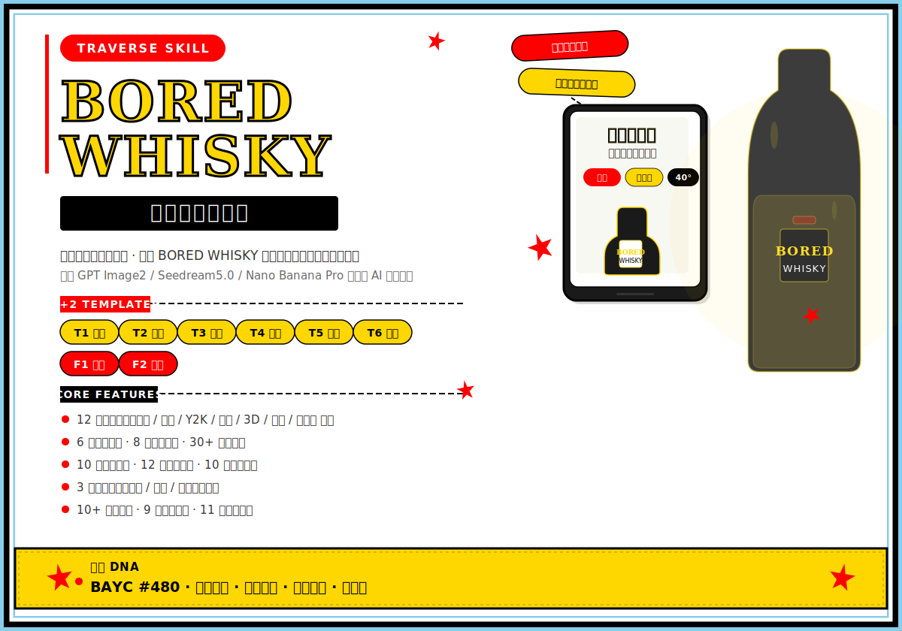
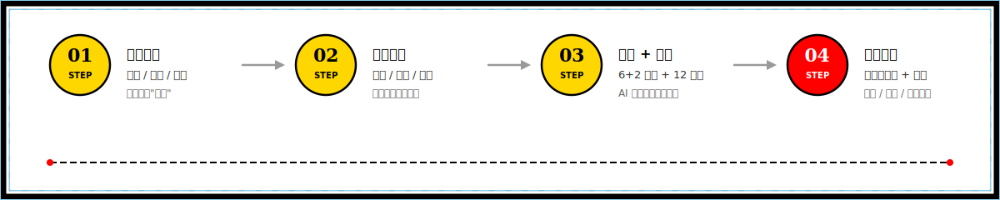
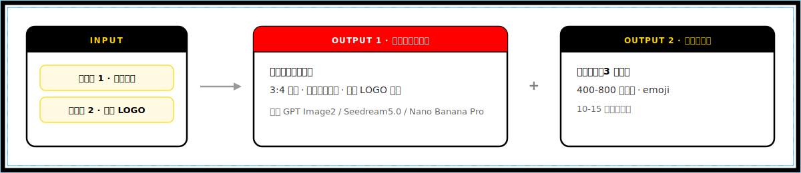

<p align="center">
  
</p>

BORED WHISKY（年轻人的口袋威士忌）专属小红书爆款图文生成 Skill。基于 **6+2 模板体系 + 12 种艺术画风 + 6 种色彩方案 + 30+ 装饰组件**，一次输出 3:4 高端封面图提示词 + 小红书完整文案（标题 + 正文 + 话题标签），适配 GPT Image2 / Seedream5.0 / Nano Banana Pro 等主流 AI 生图模型，海量风格组合不重复，日更无忧。

---

### 四步工作流

<p align="center">
  
</p>

---

### 核心能力

<details>
<summary><strong>📐 模板系统</strong> — 6+2 爆款模板，覆盖所有内容场景</summary>

| 模板 | 适用场景 | 推荐画风 | 画面特征 |
|------|---------|---------|----------|
| **T1 产品特写** | 种草、开箱、卖点展示 | S2/S3/S5/S9/S12 | 产品占 40-60%，背景简洁，大字标题压顶 |
| **T2 场景氛围** | 露营、睡前、聚会、独处 | S1/S2/S4/S7/S10/S11 | 产品融入场景，环境光主导，氛围感强 |
| **T3 对比测评** | 选购指南、横评、鉴别 | S3/S5/S6/S9/S12 | 分屏对比，参数标签，清单式排版 |
| **T4 桌面搭配** | 桌面美学、EDC、仪式感 | S1/S2/S4/S5/S7/S9/S11 | 俯视构图，产品与周边精致搭配 |
| **T5 人物出镜** | 个人体验、情感共鸣 | S1/S2/S4/S7/S10/S11 | 人物不露正脸，故事感强，产品占 25-40% |
| **T6 创意拼贴** | 潮酷、Web3、数字雅痞 | S3/S6/S8/S10/S12 | 拼贴/撕裂/胶带，色彩大胆，视觉冲击 |
| **F1/F2 自由** | 特殊节日、热点反应、图复刻 | 自由选择 | 完全自由，不受模板约束 |
</details>

<details>
<summary><strong>🎨 视觉系统</strong> — 12 画风 × 6 色彩 × 8 角度 × 30+ 装饰</summary>

**12 种艺术画风：**

| 画风 | 视觉特征 | 最佳情绪 |
|------|---------|---------|
| S1 日系生活杂志 | 自然光、柔和色调、胶片质感、呼吸感留白 | 松弛、治愈、慵懒 |
| S2 韩系 ins 极简 | 低饱和、莫兰迪色、大面积留白、纤细字体 | 高级、冷感、松弛 |
| S3 Y2K 千禧美学 | 金属质感、霓虹渐变、透明 PVC、像素字体 | 潮酷、幽默、热血 |
| S4 复古胶片摄影 | 胶片颗粒、暖色偏黄、暗角、漏光、日期戳 | 慵懒、治愈、自嘲 |
| S5 3D 渲染 C4D | 立体质感、柔和光影、圆润造型、玻璃反光 | 潮酷、高级、热血 |
| S6 扁平插画风 | 纯色块、粗描边、几何造型、波普感 | 幽默、潮酷、热血 |
| S7 水彩手绘风 | 晕染边缘、透明质感、柔和笔触、纸张纹理 | 治愈、慵懒、松弛 |
| S8 蒸汽波/Retrowave | 粉紫渐变、网格、日落、霓虹灯管 | 潮酷、忧郁、自嘲 |
| S9 极简主义 | 黑白灰为主、单一 accent、大量留白 | 高级、冷感、忧郁 |
| S10 赛博朋克 | 深蓝紫底、霓虹粉/青、雨夜反光、故障艺术 | 潮酷、热血、冷感 |
| S11 法式慵懒 | 暖米色、手写花体、报纸书本、窗边自然光 | 慵懒、松弛、治愈 |
| S12 美式复古 | 粗边框、复古配色、做旧质感、邮票标签 | 幽默、热血、自嘲 |

**6 种色彩方案（强制轮换）：**

| 方案 | 主色调 | 适用情绪 |
|------|--------|----------|
| 经典威士忌 | 琥珀色/焦糖色 + 深灰 + 金色 | 松弛、慵懒、治愈、高级 |
| 清新夏日 | 薄荷绿/淡青 + 奶油白 + 珊瑚粉 | 治愈、松弛、慵懒 |
| 复古胶片 | 暖黄/橙棕 + 米色 + 深红/墨绿 | 治愈、慵懒、自嘲 |
| 潮酷撞色 | 荧光绿/电光蓝 + 炭黑 + 荧光粉/亮黄 | 潮酷、热血、幽默 |
| 冷淡高级 | 雾霾蓝/灰粉 + 纯白/浅灰 + 香槟金 | 高级、冷感、忧郁 |
| 新中式 | 墨绿/朱红 + 米白/宣纸色 + 金色/青花蓝 | 高级、治愈、松弛 |

**8 种构图角度：** 平视正面 / 45° 俯角 / 正俯拍 Flat Lay / 低角度仰拍 / 荷兰角 / 微距特写 / 框架式 / 过肩第一人称

**30+ 装饰组件：** 几何图形、自然元素、手账贴纸、潮流符号、生活物件、信息标签……每次选 2-5 个

**10+ 背景纹理：** 纸张类（水彩纸/牛皮纸/宣纸）、材质类（大理石/木纹/皮革/牛仔布）、效果类（磨砂/噪点/渐变）

**9 种滤镜特效：** 胶片颗粒 / 暗角 / 漏光 / 柔光 / 半色调 / 双重曝光 / 移轴 / 色差 / 无滤镜

**11 种文字装饰：** 高亮底衬 / 波浪下划线 / 对话框 / 爆炸贴 / 胶带文字 / 手写批注 / 邮戳 / 方框圈选 / 删除线 / 描边字 / 双色叠印
</details>

<details>
<summary><strong>✍️ 文案系统</strong> — 10 情绪 × 12 标题 × 10 结构 × 6 CTA</summary>

**10 种情绪基调：** 潮酷 / 松弛 / 幽默 / 治愈 / 高级 / 冷感 / 自嘲 / 慵懒 / 热血 / 忧郁

**12 种标题公式：** 数字冲击 / 身份标签 / 反差认知 / 口语钩子 / 悬念揭秘 / 时间仪式 / 对比选择 / 命令诱惑 / 内心 OS / 热梗嫁接 / 否定颠覆 / 日记纪实

**10 种正文结构：** 清单体 / 故事体 / 独白体 / Before-After / 日记体 / 拼贴体 / 体验体 / 科普体 / 热梗体 / 攻略体

**6 种行动号召（轮换）：** 提问型 / 投票型 / 承诺型 / 互动型 / 留白型 / 挑战型
</details>

<details>
<summary><strong>🔍 质量控制</strong> — 13 维防同质化 + 严格品牌规范</summary>

- **3 种生成模式**：模板模式（AI 推荐 6+2 模板）、自由模式（不受约束）、参考图复刻模式（分析并复刻参考图风格）
- **品牌知识库分离**：`brand.md` 独立管理品牌 DNA、用户画像、核心词汇与视觉规范，修改即全局生效
- **13 维度防同质化自查**：模板 / 画风 / 色彩 / 情绪 / 角度 / 文案结构 / 标题公式 / 装饰组合 / 背景纹理 / 滤镜 / 卖点 / CTA / emoji
- **严格产品图锁定**：角度/方向/细节 100% 还原参考图，手掌大小真实比例（15-18cm）
- **品牌 LOGO 植入**：单行不折行，占画面 8-15%，清晰可辨识
- **AI 审核规避**：人物不露完整正脸，优先侧脸/背影/局部/道具遮挡/景深虚化
- **猿猴红线**：产品瓶身自带 BAYC #480 可保留，严禁额外生成任何猿猴/猴子形象
- **容量规则**：文案中不得出现 200ml/350ML，使用"口袋装""小瓶装""手掌大小"替代
</details>

### 每次生成输出

<p align="center">
  
</p>

---

### 项目结构

```
bored-whisky-xhs/
├── SKILL.md              # Skill 主文件（模板体系、画风库、视觉规范、文案规则）
├── brand.md              # 品牌知识库（品牌 DNA、用户画像、核心词汇、瓶身/LOGO/容量规则）
├── assets/
│   └── readme/            # README 视觉插图
└── README.md             # 本文件
```

---

### 安装

```bash
# clone 后放入 .trae/skills/ 目录
git clone <your-repo-url>
cp -r bored-whisky-xhs/ your-project/.trae/skills/
```

### 使用

**最简路径 — 直接对话：**
```
帮我生成一篇 BORED WHISKY 的露营主题图文
做一张睡前小酌氛围的封面图 + 文案
```

**半自定义 — 指定模板或画风：**
```
用 T2 氛围模板 + 日系杂志风，松弛感，露营场景
做一张 T6 拼贴 + Y2K 画风的封面，潮酷感
```

**热梗追热点 — AI 自动嫁接：**
```
结合"班味"热梗做一篇 BORED WHISKY 的
结合最近热点做一篇
```

---

### 风格组合计算

**理论组合数：** 6 模板 × 12 画风 × 6 色彩 × 8 角度 × 10 情绪 × 10 文案结构 × 12 标题公式 = **4,147,200** 种

加上 30+ 装饰组件、10+ 背景纹理、9 种滤镜、11 种文字装饰的排列组合，实际变化空间近乎无限。

---

### 字体声明

本 Skill 生成的所有提示词均指定使用开源免费可商用中文字体：思源黑体、思源宋体、阿里巴巴普惠体、站酷高端黑、站酷快乐体。根据画风自动选择最适配字体。商用无忧。

---

### 注意事项

- 本 Skill 生成的提示词需配合外部 AI 生图模型使用（GPT Image2 / Nano Banana Pro / Seedream5.0 Pro 等）
- 使用时必须同时上传两张参考图：参考图 1（产品图，建议透明底 PNG）+ 参考图 2（品牌 LOGO）
- 产品外观严格按照参考图 1 还原，不自行脑补未展示的部位和角度
- 产品尺寸约为成人手掌大小（15-18cm），与其他物体同框时保持真实比例
- **严禁生成额外的猴子/BAYC 图像，只保留产品本身内置的品牌 logo**
- 人物处理优先：侧脸/背影/局部/道具遮挡/景深虚化，禁止清晰完整正脸特写
- **文案中不出现具体容量数字（200ml/350ML），使用"口袋装""小瓶装""手掌大小"替代**

### License

本 Skill 为 BORED WHISKY 品牌营销内容生产工具。代码和提示词框架部分可自由使用和修改。

### 反馈与贡献

欢迎提交 Issue 反馈使用问题或建议新模板/新画风/新功能。